# Cabinlove

Welcome to the Cabinlove website!

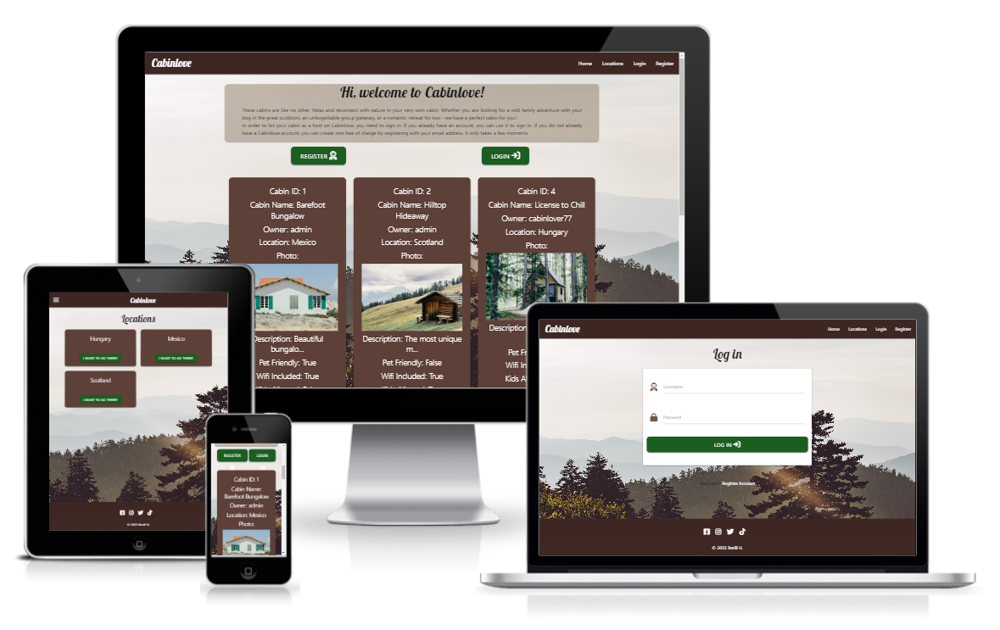

Cabinlove is a website that aims to provide information about a variety of cabins from all over the world, where could explore, create and share cabins in one place.

## The goal for this project

The Cabinlove is an online collection of cabins all over the world. I wanted to create a site whre users can easily access information about the cabins, and also create and save their owns. I wanted to build a responsive site that can be accessed across all devices and display the information in an user-frienldy way, contributing to an overall good user experience.

## Site Owner Goals

- To provide  information about cabins all over the world.
- To promote cabins.
- To encourage users to create an account.
- To encourage users to create cabins for the website.
- To present the user with a website that is fully responsive and easy to use.

## User stories

As first-time or casual user (as someone who has not registered):

- As an user I want to understand the main purpose of the website easily.
- As an user I want to be able to navigate throughout the site.
- As an user I want to enjoy nice and clean design and style that is inline with the subject of the site.
- As an user I want to browse a variety of cabins all around the world.
- As an user I want to list location specific cabins.
- As an user I want to be able to view cabins without having to create an account.
- As an user I want the option to register for an account, if I want to return later.

As a returning or registered user:

- As an user I want to log into my account.
- As an user I want to log out from my account.
- As an user I want to create my own cabins.
- As an user I want to edit the cabins I have added.
- As an user I want to delete the cabins I have added.
- As an user I want to contact and follow the website via social media.

As admin:

- As admin I want to edit my own cabins.
- As admin I want to add new cabins.
- As admin I want to add new locations.
- As admin I want to edit existing locations.
- As admin I want to delete existing locations.

## UX

### Fonts

- I have used Google Fonts to find the font that suits best to the feel of the website. I have used [Lobster](https://fonts.google.com/specimen/Lobster) for the logo and the main titles.

### Icons

- The icons on the website were taken from [FontAwesome](https://fontawesome.com/).

### Colors

- The main colours on the website are different browns, white, and dark green. This is because I wanted to use natural colours which are inline with the theme of the site.

### Wireframes

Hand-drawn wireframes.

<b>Wireframes</b> (click to expand)

- [Home Page](cabinlove/static/images/wf_home.jpg)
- [Login Page](cabinlove/static/images/wf_login.jpg)
- [Registration Page](cabinlove/static/images/wf_resgister.jpg)
- [Locations page](cabinlove/static/images/wf_locations.jpg)
- [Profile page](cabinlove/static/images/wf_profile.jpg)

## Features

### Existing Features

1. Design
    - A clean and simple design and layout with consistency throughout.
    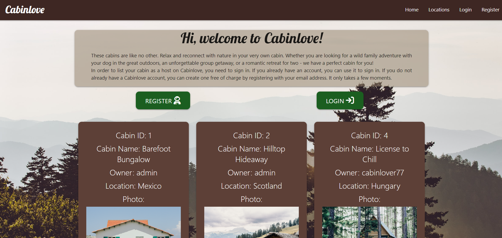
    - Easy navigation by using the navigation bar. Nav links are clearly idenfied both on desktop and when sidenav is expanded on smaller the devices.
    - Responsive design allowing users to use site across all devices.
    
2. Cabins
    - Cabins can be created, read, updated and deleted (CRUD) by the registered users.
    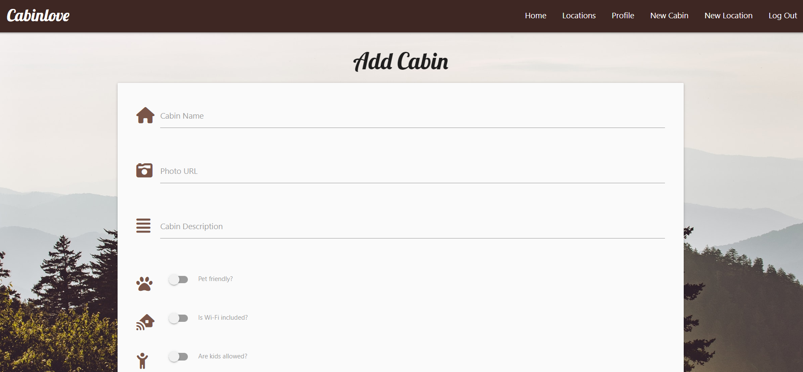
    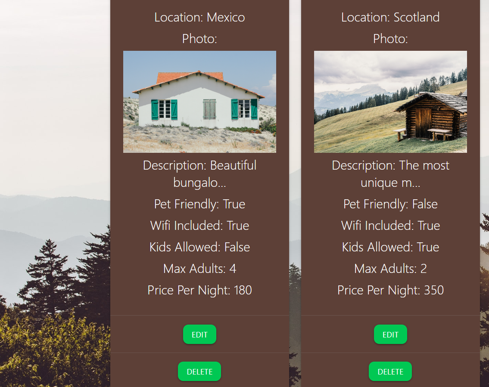
    - Users of the site, either logged in or not, can list cabins by locations.
    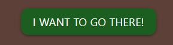
    - Logged in users have access to their profile, where they can view their own cabins.
    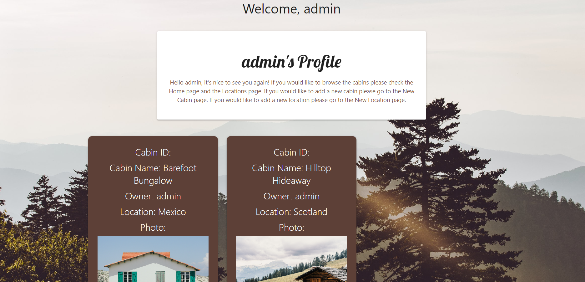
    - Flash messages will appear when users create, edit, delete the cabins.
    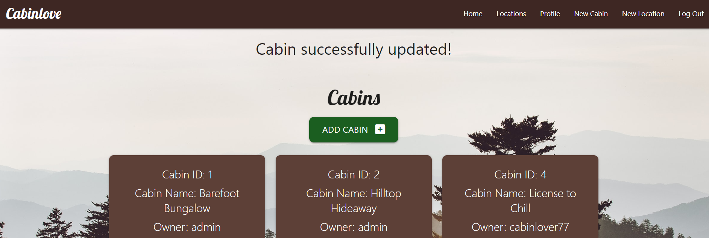
3. Register, Login and Logout
    - Users of the site can create an account.
    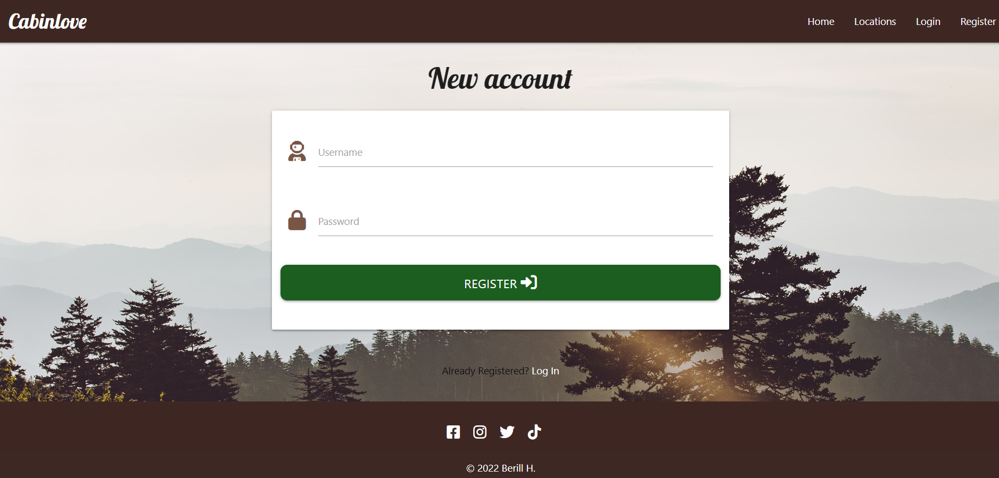
    - Users can login into their existing account.
    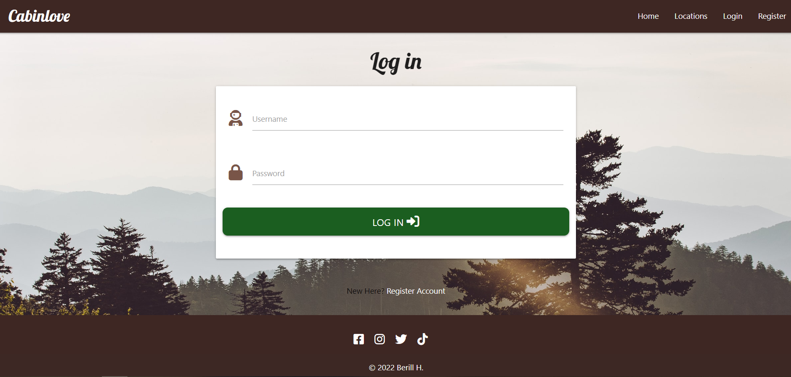
    - Users can logout of their account.
4. Locations
    - Admin can create, edit and delete locations.
    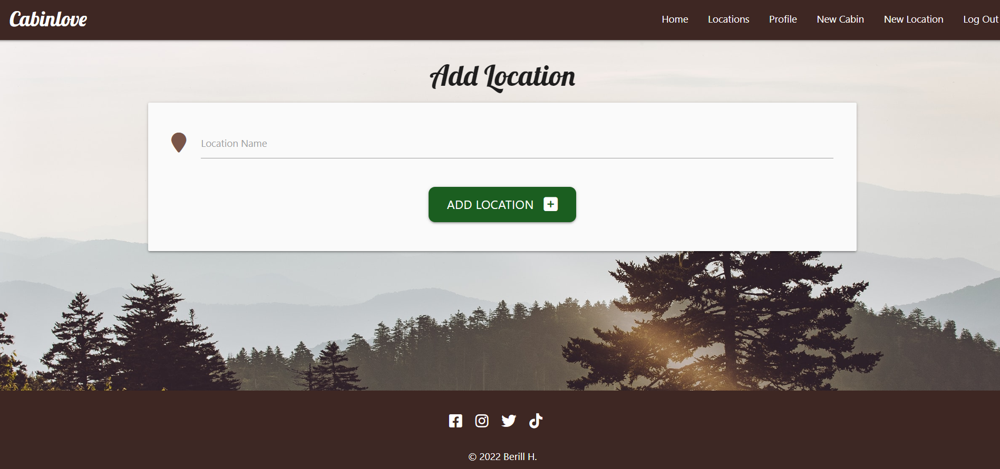
    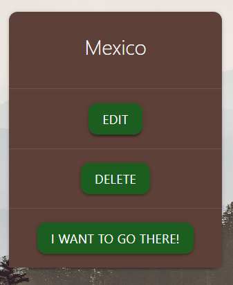

### Defensive Programming

To protect the site and defend against any "brute force", I added some defensive programming:
Created Python functions that:
- Check if a user is logged in. This checks if the session user is active, if so allows the user to perform the action. If not will redirect user to the appropriate page with flash message.
- Check if it is correct user (has the permission). For example with edit cabins, this checks if the session user is equal to the one who created the cabin. If so, it allows the user to edit the cabin. If the check fails, it redirects the user with appropriate flash message.
- Check if user is superuser (is admin). The admin is the only one who can add, edit and delete locations. If the check fails, the user is redirected and a flash message displayed.
- Certain action buttons are only displayed to certain users, for example 'Add cabin' is only displayed to users that are logged in. Use of Jinga for loops and if conditions to display if users are authorised to do so. 

### Features left to implement

- A contact form where users can ask for more informations regarding the cabins.
- An option for newsletter signup.
- Users to have ability to edit account, including changing password.
- Users to have ability to delete their account.
- Individual pages for all the cabins.

## Structure of the site

The structure of the site has been developed to enable users to access and use the site with ease.
- Home Page- accessible by all users, whether logged in or not. 
- Navbar - is accessible to all users. The navbar changes to a sidenav on tablet screens and smaller for responsiveness. The options available in the navbar change depending on whether a user is logged in or not.

    * For not logged in users:  
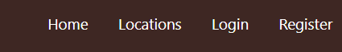
    * For logged in users:  
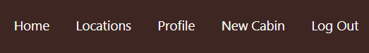
    * For admin:  
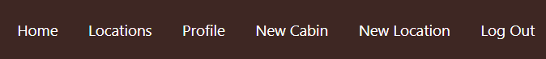

- List of cabins is accessible to all users, whether logged in or not.
- Add new cabin is accessible only to registered users.
- Edit cabin and Delete cabin is accessible only to the registered user who created that cabin.
- The Profile page has the users name displayed in the welcome message. Users can see all the cabins they've created on this page.

## Technologies used

### Languages

- [HTML5](https://developer.mozilla.org/en-US/docs/Glossary/HTML5)
- [CSS3](https://developer.mozilla.org/en-US/docs/Web/CSS)
- [JavaScript](https://www.javascript.com/)
- [Python](https://www.python.org/)

### Frameworks, Tools and Libraries

- [Materialize](https://materializecss.com/) - Used for responsiveness, styling and elements such as forms, collapasible tables and tabs.
- [Flask](https://flask.palletsprojects.com/en/2.0.x/) - Micro framework for building applications.
- [Chrome Dev Tools](https://developer.chrome.com/docs/devtools/) - Used for overall development and testing for example the  responsiveness and appearance.
- [Google Fonts](https://fonts.google.com/) - Used to import font to the website.
- [Font Awesome](https://fontawesome.com/) - Used for icons throughout the site.
- [W3C](https://www.w3.org/) - Used for validation.
- [W3C CSS Validator](https://jigsaw.w3.org/css-validator/) - Used to validate CSS code.
- [JSHint](https://jshint.com/) - Used to validate JavaScript files.
- [PEP8 online validator](http://pep8online.com/) - Used to validate Python code.
- Git - Used for version control.
- [Gitpod](https://gitpod.io/) - Used as a cloud-based IDE.
- [GitHub](https://github.com/) - Used for storing code securely online.
- [Balsamiq](https://balsamiq.com/) - Used to create wireframes and schema diagram.

## Testing

To view all testing documentation please refer to [TESTING.md](TESTING.md).

## Deployment

The site was deployed to Heroku. The live link can be found at [cabinlove](https://cabinlove.herokuapp.com/)

The steps to deploy a Heroku app are as follows: 
1.  Log in to Heroku or create an account if required.
2.  Create a Heroku app - select 'New', from the drop-down menu select Create New App. The app name provided must be unique.
3.  Select a region.
4.  Create.
5.  Navigate to the Resources tab and add a Heroku Postgres database.
6.  Access the Settings Tab and find the Config Vars. For this project you will need the following config vars:
    *   `DATABASE_URL` = the url of your heroku postgres database.
    *   `SECRET_KEY` = a secret key for your app.
    *   `PORT` = 5000
    *   `DEBUG` = set to 'True' during development and 'False' upon deployment.
    *   `IP` = Your IP address

Please see this [official documentation](https://devcenter.heroku.com/articles/config-vars) on Heroku configuration for more details.

7.  Navigate to the Deploy tab.
8.  Select Github as the deployment method.
9.  Follow steps to link to the appropriate GitHub account.
10. If you wish, enable Automatic Deploys for automatic deployment when you push updates to Github. Or alternativley, select the correct branch for deployment from the drop-down menu and click Deploy Branch for manual deployment.

Final steps: 
1. Create a `Procfile` in your repository containing `web: python run.py` so that Heroku will identify the app as a Python app.
2. Create an untracked file called `env.py` in your repo and input the config vars you previously established in Heroku.
3. Create a `requirements.txt` file
    - If you want to freeze your own packages into this file, run `pip3 freeze --local > requirements.txt` in the console.
    - To instal only the packages that are already listed in the cabinlove repo requirements (if making a local copy/clone) run `pip3 install -r requirements.txt` in the console.

### Cloning

Cloning a repository makes it easier to contribute, fix merge conflicts, add or remove files, and push larger commits. To clone this repository from GitHub to a local computer use the following steps:

1.  On GitHub, navigate to the main page of the repository.

2.  Above the list of files, click Code.

3.  Click Use GitHub CLI, then the copy icon.

4.  Open Git Bash and change the current working directory to the location where you want the cloned directory.

5.  Type git clone, and then paste the URL that was copied from step 3 above - i.e., `git clone https://github.com/berill98/cabinlove.git`

6. Press Enter to create the local clone.

### Forking

A fork is a copy of a repository. Forking a repository allows you to freely experiment with changes without affecting the original project.

To fork this project go to the top left of the repository, where you see the Fork Icon and click Fork.  This will create a copy of the repository for you.

## Credits

### Media

| Media  | Photographer  | Link |
| :------------ |:---------------:| -----:|
| Background image | Sean Stratton | [Unsplash](https://unsplash.com/photos/rvVOTp6nyaM) |

### Resources used

I used the [Code Institute](https://codeinstitute.net/) lessons as an inspiration for this project.

### Setup and text in README.md

I have used my own README.md file from MS2 as inspiration for this README.md.

## Acknowledgments

My mentor Tim for his support, advice and feedback.