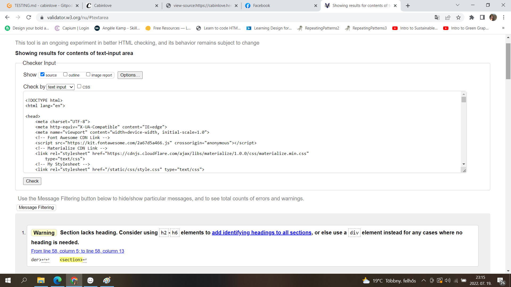
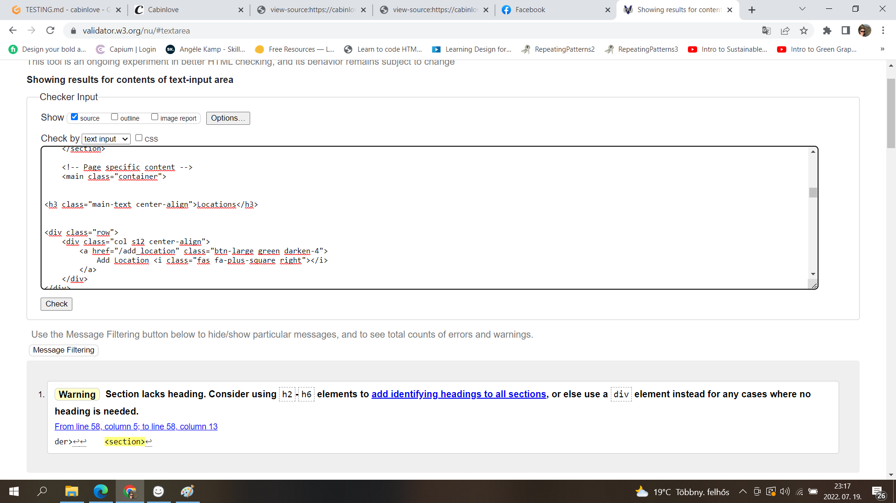
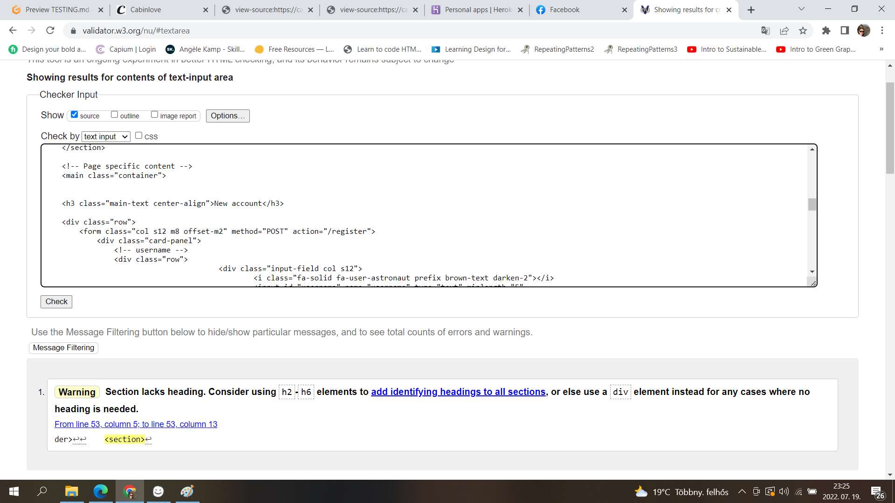
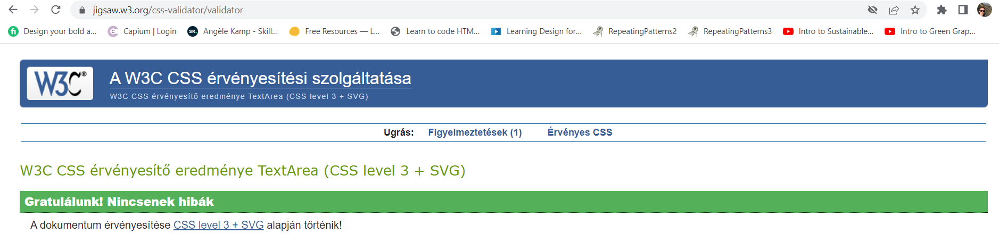
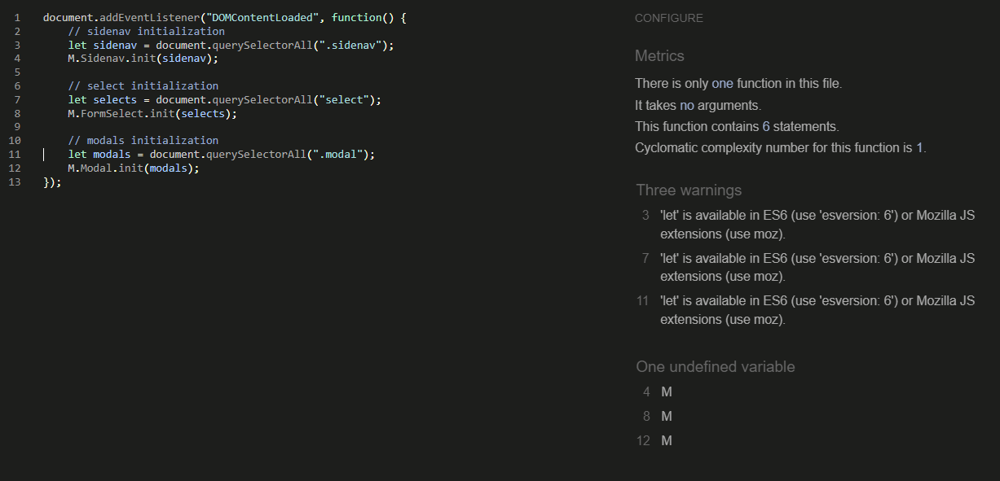
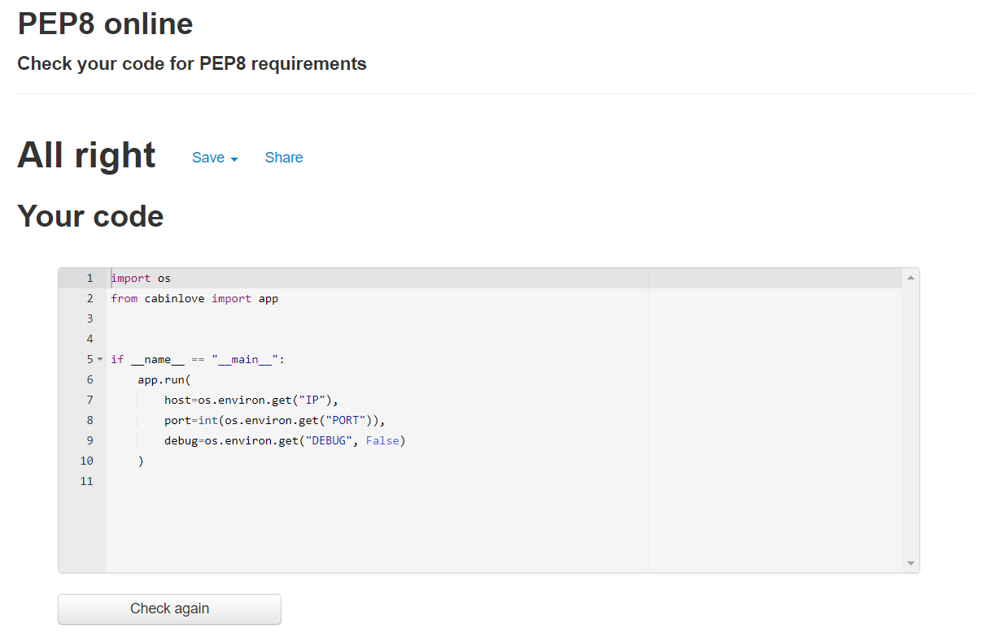
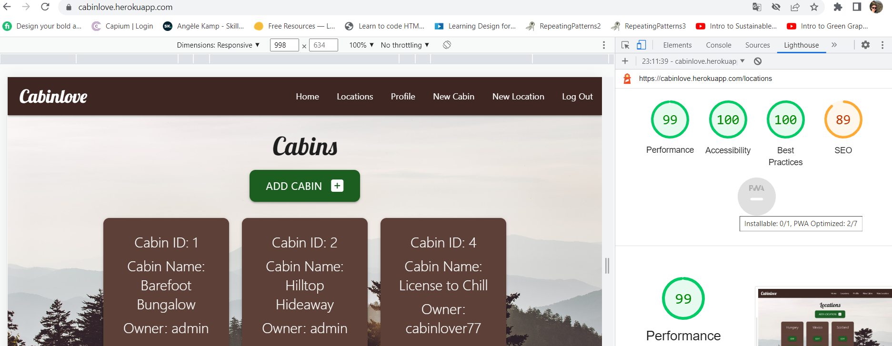
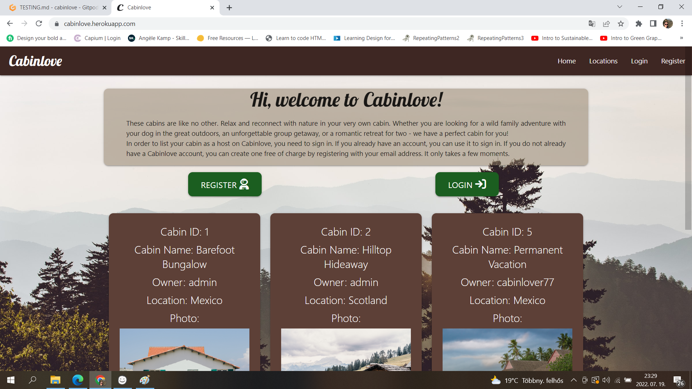
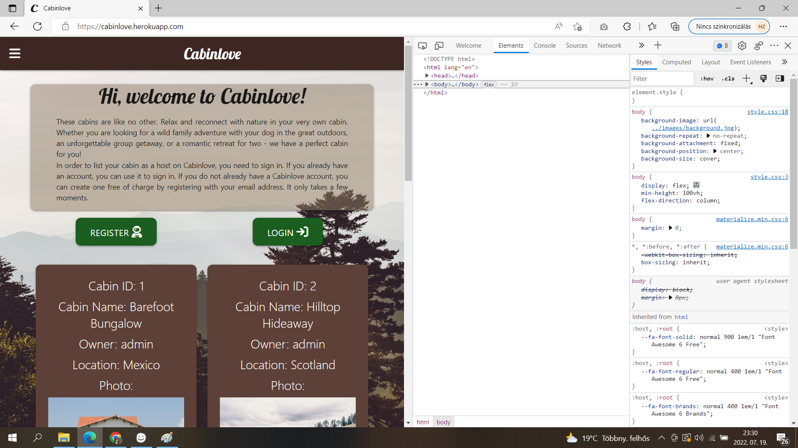
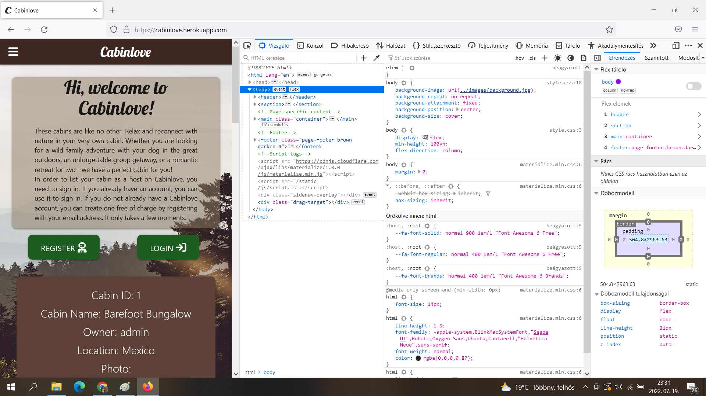

# Testing 

## Validator Testing 

### HTML Validation
All HTML pages were tested using [W3C Markup Validation](https://validator.w3.org/). 
- One warning was displayed on all pages. This refers to the section element that holds the flash messages. Please see below the examples for the HTML validation.

### CSS Validation
The [W3C CSS Validator](https://jigsaw.w3.org/css-validator/) was used to test the style.css file. No changes were required.

### JavaScript Validation
[JSHint Validator](https://jshint.com/) was used to validate all JavaScript files. 

### Python Validation
[PEP8 Online](http://pep8online.com/) validator was used to test the run.py file.

### Accessibility
The site achieved a Lighthouse accessibility score of 100% which confirms that the website is accessible.

## Responsiveness Testing

- The site was tested on various devices such as desktop, laptops and mobiles to ensure responsiveness. The website performed as intended. The responsive design was also checked using Chrome Developer Tools across multiple devices.

<b>Responsiveness testing</b> (click to expand)

Desktop view

Tablet view

Mobile view

## Browser Testing

## Form Testing

## Unfixed Bugs

## User story testing
